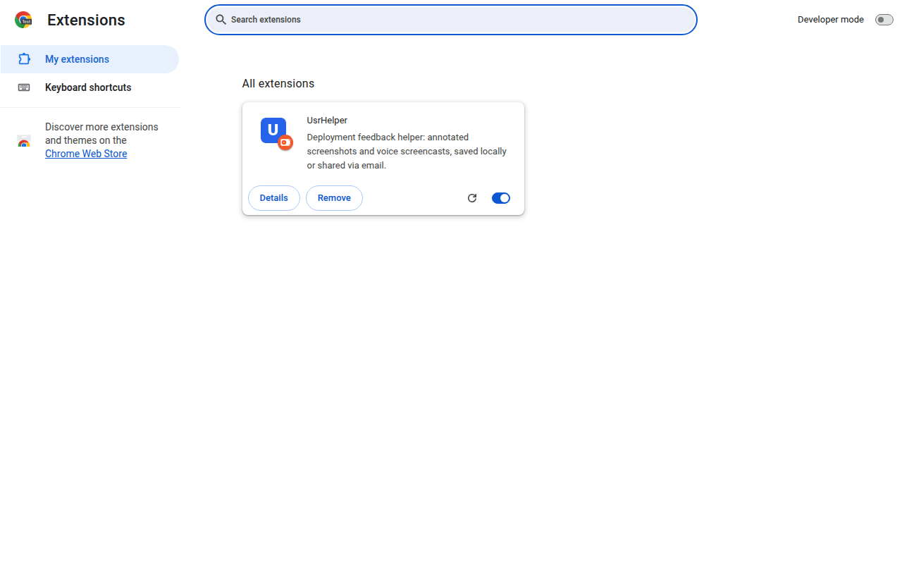
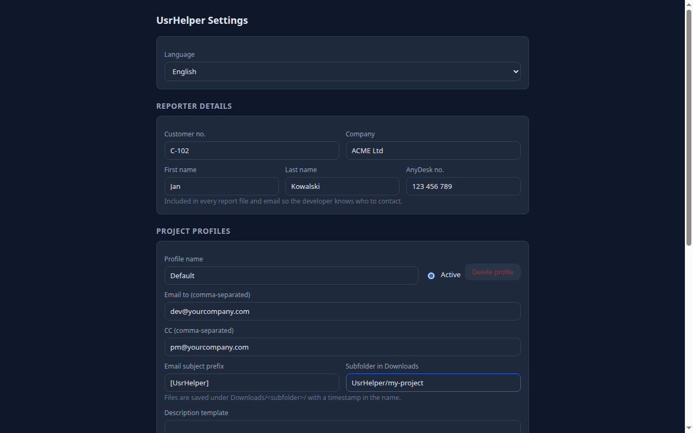
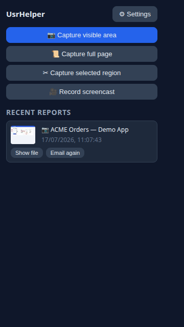
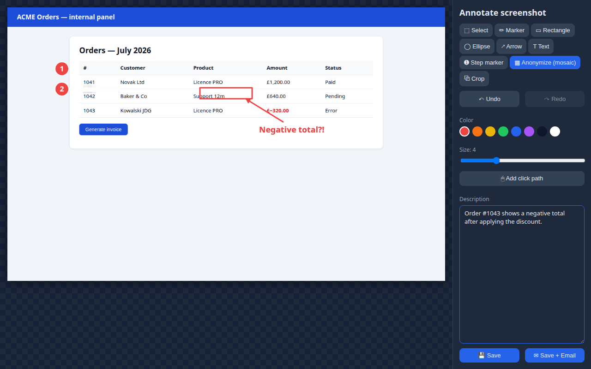
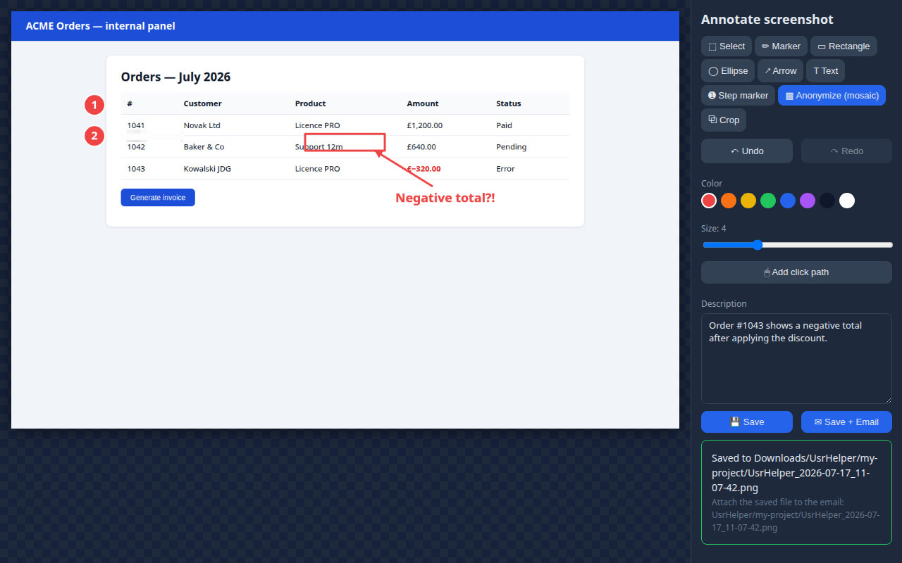
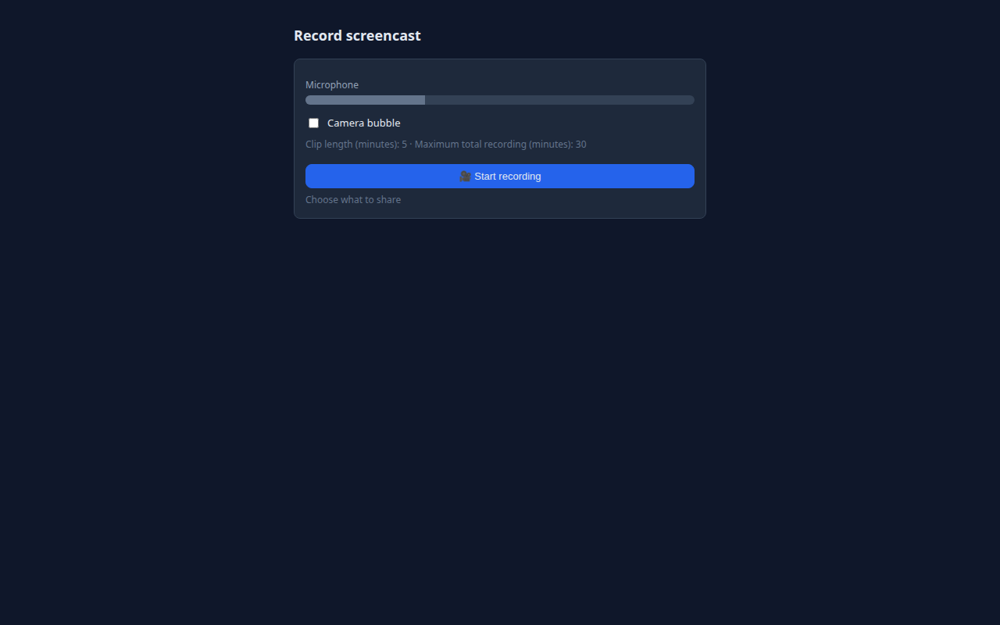
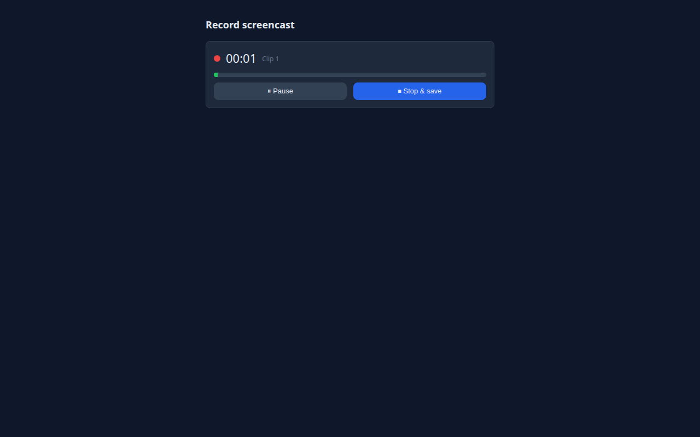
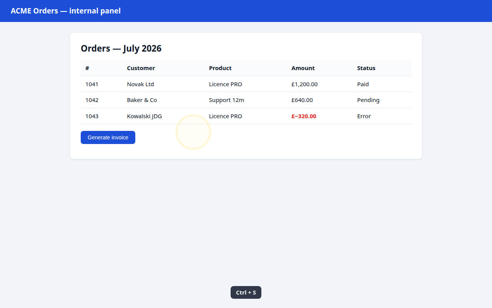
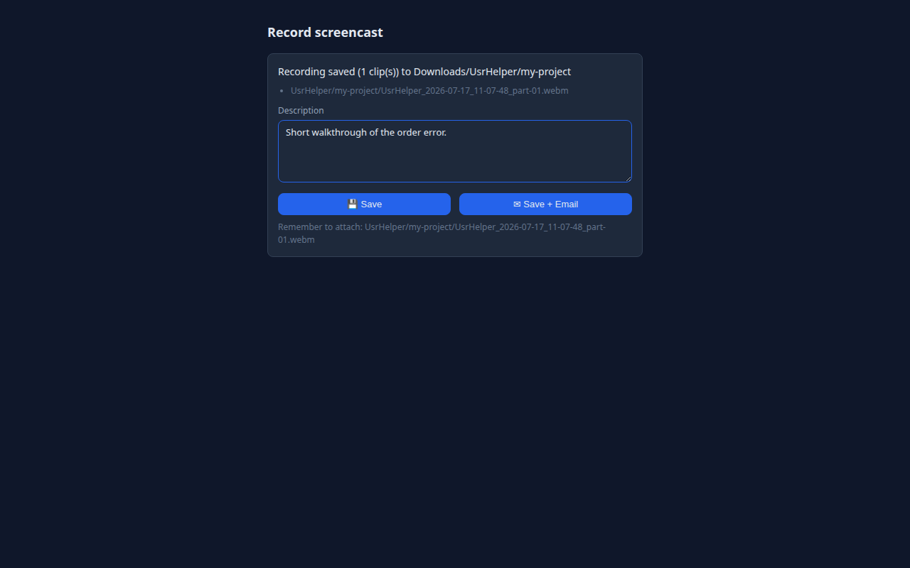

# UsrHelper — Instrukcja użytkownika

> Wersja wtyczki: 0.4.1+ · [English version](USER_GUIDE.en.md)

**UsrHelper** to wtyczka do przeglądarki Chrome, która ułatwia zgłaszanie uwag podczas wdrożeń oprogramowania. Robisz zrzut ekranu z adnotacjami albo nagrywasz screencast z komentarzem głosowym, a gotowy raport zapisuje się na Twoim dysku i jednym kliknięciem trafia do emaila. Wszystko zostaje na Twoim komputerze — wtyczka nie wysyła danych na żaden serwer.

---

## Spis treści

1. [Instalacja](#1-instalacja)
2. [Pierwsza konfiguracja](#2-pierwsza-konfiguracja)
3. [Zrzuty ekranu](#3-zrzuty-ekranu)
4. [Edytor adnotacji](#4-edytor-adnotacji)
5. [Nagrywanie screencastów](#5-nagrywanie-screencastów)
6. [Historia i profile projektów](#6-historia-i-profile-projektów)
7. [Co zawiera raport](#7-co-zawiera-raport)
8. [Rozwiązywanie problemów (FAQ)](#8-rozwiązywanie-problemów-faq)

---

## 1. Instalacja

1. Pobierz najnowszy plik `usrhelper-X.Y.Z-chrome.zip` z [GitHub Releases](https://github.com/AmigoUK/UsrHelper/releases/latest).
2. Rozpakuj archiwum do stałego folderu (np. `C:\UsrHelper` albo `~/UsrHelper`). **Folder musi pozostać na dysku** — Chrome ładuje wtyczkę z tego miejsca.
3. Otwórz `chrome://extensions` i włącz **Tryb dewelopera** (przełącznik w prawym górnym rogu).
4. Kliknij **Załaduj rozpakowane** (Load unpacked) i wskaż rozpakowany folder (ten z plikiem `manifest.json`).
5. Przypnij ikonę **U** do paska: kliknij ikonę puzzla → pinezka obok „UsrHelper".

**Aktualizacja:** pobierz nowy zip, podmień zawartość folderu i kliknij ⟳ (Odśwież) przy wtyczce na `chrome://extensions`.

## 2. Pierwsza konfiguracja

Otwórz ustawienia: kliknij ikonę **U** → **⚙ Settings** (albo `chrome://extensions` → UsrHelper → Szczegóły → Opcje rozszerzenia).

Ustaw kolejno:

| Sekcja | Co wpisać |
|---|---|
| **Language** | `Polski` — cały interfejs przełączy się na polski (domyślnie English). |
| **Dane zgłaszającego** | Nr klienta, firma, imię, nazwisko i numer AnyDesk — trafiają do każdego raportu i emaila, żeby developer wiedział, kto zgłasza i jak się połączyć. |
| **Profile projektów** | Adresy email odbiorców (**Email to**) i kopii (**CC**) rozdzielone przecinkami, prefiks tematu (np. `[Projekt X]`), **podfolder w Pobranych** gdzie lądują pliki, opcjonalny szablon opisu oraz limity nagrania (długość klipu / maksymalny czas). |
| **Przełączniki** | Wizualizacja kliknięć i klawiszy na nagraniu, znacznik czasu, dymek z kamerką, śledzenie ścieżki kliknięć, przechwytywanie błędów konsoli. |

Każda zmiana zapisuje się automatycznie (zielony komunikat „Zapisano ustawienia").

## 3. Zrzuty ekranu

Kliknij ikonę **U** na pasku:

Do wyboru są trzy tryby:

- **📷 Zrzut widocznego obszaru** — natychmiastowy zrzut tego, co widać w oknie.
- **📜 Zrzut całej strony** — wtyczka sama przewija stronę od góry do dołu i skleja jeden wysoki obraz (przyklejone nagłówki pojawiają się tylko raz).
- **✂ Zrzut zaznaczonego fragmentu** — kursor zmienia się w celownik; przeciągnij prostokąt po stronie. Klawisz `Esc` anuluje.

Po każdym zrzucie otwiera się **edytor adnotacji** w nowej karcie.

> Uwaga: stron wewnętrznych przeglądarki (`chrome://…`, Chrome Web Store) nie da się przechwycić — przyciski będą wyszarzone.

## 4. Edytor adnotacji

Narzędzia (pasek po prawej):

| Narzędzie | Działanie |
|---|---|
| **Zaznacz** | Kliknij adnotację, aby ją zaznaczyć; przeciągnij, aby przesunąć; `Delete` usuwa. |
| **Marker** | Odręczne rysowanie. |
| **Prostokąt / Elipsa** | Ramka wokół istotnego elementu. |
| **Strzałka** | Wskazanie miejsca problemu. |
| **Tekst** | Kliknij na obrazie, wpisz treść, zatwierdź `Enter` (`Esc` anuluje). |
| **Znacznik kroku** | Każde kliknięcie stawia kółko z kolejnym numerem (1, 2, 3…) — idealne do instrukcji „krok po kroku". |
| **Anonimizuj (mozaika)** | Zamaluj dane wrażliwe (nazwiska, kwoty, tokeny) — obszar zostaje **nieodwracalnie** zamieniony w mozaikę pikselową w zapisanym pliku. |
| **Kadruj** | Przeciągnij prostokąt i kliknij „Zastosuj kadr". |

Dodatkowo: wybór **koloru** i **grubości**, pełne **Cofnij / Ponów** (`Ctrl+Z` / `Ctrl+Y`) oraz przycisk **„Nanieś ścieżkę kliknięć"** — stawia pomarańczowe numerowane znaczniki w miejscach, które klikałeś na stronie przed zrobieniem zrzutu.

W polu **Opis** opisz problem lub instrukcję, następnie:

- **💾 Zapisz** — plik PNG + plik `.json` z metadanymi lądują w `Pobrane/<podfolder>/` z timestampem w nazwie (np. `UsrHelper_2026-07-17_14-32-05.png`);
- **✉ Zapisz + Email** — dodatkowo otwiera się nowa wiadomość w Twoim programie pocztowym z adresatami, tematem i opisem. **Załącznik musisz dodać ręcznie** — wtyczka pokazuje dokładną ścieżkę zapisanego pliku.

## 5. Nagrywanie screencastów

Kliknij **🎥 Nagraj screencast** w popupie. Otworzy się panel nagrywania:

1. **Sprawdź mikrofon** — zielony pasek porusza się, gdy mówisz. Brak paska = brak dźwięku na nagraniu.
2. Opcjonalnie włącz **dymek z kamerką** (Twój obraz w kółku, styl Loom).
3. Kliknij **Rozpocznij nagrywanie** i w oknie Chrome wybierz, co udostępniasz: **karta / okno / cały ekran**.
4. Po odliczaniu **3-2-1** nagranie startuje — możesz swobodnie przełączać się na inne karty i aplikacje.

Podczas nagrania na stronach widoczne są: **żółte kręgi** przy kliknięciach (niebieskie dla prawego przycisku), **podpisy klawiszy** (np. `Ctrl + S` — zwykłe pisanie nie jest pokazywane, prywatność!) oraz **zegar** w rogu:

**Pauza / Wznów** zatrzymuje zegar i nagranie. **⏹ Zatrzymaj i zapisz** kończy sesję. Nagranie dzieli się automatycznie na **samodzielne klipy** (domyślnie po 5 minut, limit całości 30 minut — konfigurowalne w profilu). Każdy klip to osobny plik `.webm` (`…_part-01.webm`, `…_part-02.webm`).

Po zatrzymaniu dopisz opis i kliknij **💾 Zapisz** (metadane `.json`) lub **✉ Zapisz + Email**.

## 6. Historia i profile projektów

Popup pokazuje **ostatnie zgłoszenia** z miniaturami:

- **Pokaż plik** — otwiera menedżer plików z zaznaczonym plikiem;
- **Wyślij ponownie** — otwiera nową wiadomość email z danymi zgłoszenia.

Jeśli masz kilka **profili projektów** (różni odbiorcy, foldery, limity), przełączasz je w popupie jedną listą rozwijaną — wszystkie kolejne zgłoszenia używają aktywnego profilu.

## 7. Co zawiera raport

Każde zgłoszenie to komplet plików w `Pobrane/<podfolder>/`:

| Plik | Zawartość |
|---|---|
| `UsrHelper_<data>_<czas>.png` | Zrzut z adnotacjami i timestampem w rogu. |
| `UsrHelper_<data>_<czas>_part-NN.webm` | Klipy nagrania (z wypalonym zegarem i dymkiem kamerki). |
| `UsrHelper_<data>_<czas>.json` | Opis, dane zgłaszającego, dokładny czas, adres i tytuł strony, środowisko (przeglądarka, system, rozdzielczość), ostatnie błędy konsoli JavaScript, ścieżka kliknięć, lista plików. |

Timestamp jest w trzech miejscach: w nazwie pliku, widoczny na obrazie/nagraniu i w pliku `.json` — łatwo powiązać zgłoszenie z logami serwera.

## 8. Rozwiązywanie problemów (FAQ)

**Przyciski zrzutów są wyszarzone.** Jesteś na stronie wewnętrznej przeglądarki (`chrome://…`) lub w Chrome Web Store — tych stron nie można przechwytywać. Przejdź na zwykłą stronę.

**Nagranie nie ma dźwięku.** Chrome zablokował mikrofon dla wtyczki. Kliknij ikonę kłódki/suwaków przy pasku adresu panelu nagrywania i zezwól na mikrofon, albo sprawdź mikrofon systemowy. Panel ostrzega przed startem, gdy mikrofonu brak.

**Nagranie zatrzymało się samo.** Osiągnąłeś maksymalny czas (domyślnie 30 min). Wszystkie klipy do tego momentu są zapisane. Limit zmienisz w ustawieniach profilu.

**Gdzie są moje pliki?** W folderze `Pobrane/<podfolder>/` (podfolder ustawiasz w profilu; domyślnie `UsrHelper`). Najszybciej: popup → **Pokaż plik**.

**Email otwiera się bez załącznika.** To ograniczenie mechanizmu `mailto:` — żaden program nie pozwala wtyczce samodzielnie dołączyć pliku. Wtyczka pokazuje dokładną ścieżkę; przeciągnij plik do wiadomości.

**Zamazane dane — czy na pewno bezpieczne?** Tak. Mozaika jest wtapiana w pikselową zawartość pliku PNG przy zapisie — oryginalnych pikseli nie da się odzyskać z pliku wynikowego.

---

*UsrHelper · [github.com/AmigoUK/UsrHelper](https://github.com/AmigoUK/UsrHelper) · Project & Development: Tomasz 'Amigo' Lewandowski · [dev@attv.uk](mailto:dev@attv.uk) · [www.attv.uk](https://www.attv.uk)*
